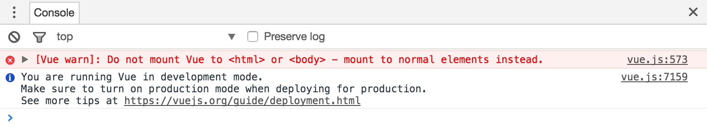
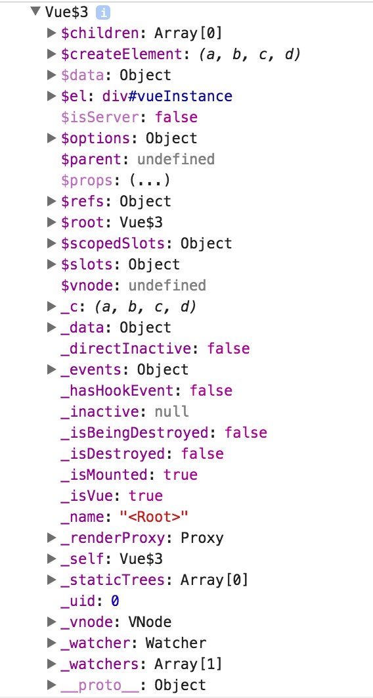
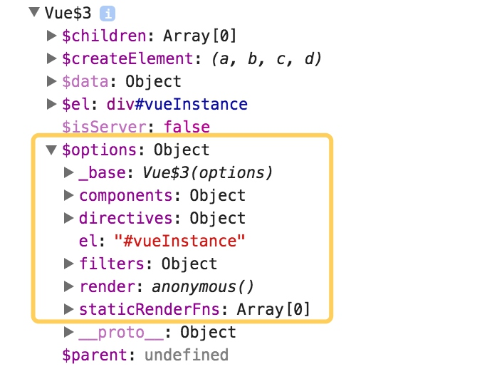

# 第一节：html中Vue基础指令
Vue是一个小巧轻便的JavaScript库。它有一个简单易懂的API，能够让开发者在开发web应用的时候更加简易便捷。实际上，一直让Vue引以为豪的是它的便捷性、执行力、灵活性。

第一篇教程的目的就是通过一些例子，让你能够概览一些基本概念和指令。在接下来的其他教程里，你会学到Vue更多的有用的特性，然后在Vue全家桶的大型项目上灵活运动。

## 了解你的第一个Vue实例
我们可以先初始化一个html页面，然后我们需要引入Vue2.0 的 js 在线 cdn。引入的方式有很多，我们可以在script中引入Vue的cdn，或者去官网上下载Vue2.0 的min.js，或者用 npm 安装一个Vue2.0 的依赖。方便起见，本文中就用cdn引入。

```html
<!DOCTYPE html>
      <html>
            <head>
                  <title>从零开始学Vue2.0</title>
            </head>
      <body>
            // 这个cdn链接会与npm包发布的版本保持实时同步更新
            <script src="https://unpkg.com/vue@2.2.2/dist/vue.js"></script>
      </body>
</html>
```

> 当你在开发过程中，确保你使用的是没有压缩过的版本，因为没有压缩的版本会提供有用的详细的警告，将会给你的代码书写节省很多时间。

我们先在html中创建一个div，并在js中创建一个Vue实例，然后将div和实例绑定起来。在Vue1.0的时候是可以把实例对象挂载在 `<body>` 或者 `<html>` 上的，但是Vue2.0 不允许这样。

如果你那么做了，控制台会报错，告诉我们需要把实例挂载在其他dom上。


当你创建一个新的Vue实例的时候要使用Vue()构造器，然后在你的实例中指出你的挂载点（用el来表示）。这个挂载点就是你想要划分出来的Vue实例的边界。挂载点和实例边界是一一对应的，你只能在挂载点上处理你实例边界内的事务，而不能在你的挂载点上处理实例边界外的事务。
在Vue2.0实例中设置挂载点的参数是 “` el ` ”，el 的值用边界dom元素定义。

```html
<!DOCTYPE html>
      <html>
            <head>
                  <title>从零开始学Vue2.0</title>
                  <script src="https://unpkg.com/vue@2.2.2/dist/vue.js"></script>
            </head>
      <body>
            <div id="vueInstance">这中间就是实例挂载点的实例边界</div>
            <script>
                  // 创建一个新的Vue实例，并设置挂载点，
                  // 所以该实例的控制范围就在 #vueInstance 这个dom元素包裹的范围内
                  var V = new Vue({
                        el : '#vueInstance'
                  });
            </script>
      </body>
</html>
```

如上，new一个Vue()就能创建一个新的实例，然后指定一个DOM元素作为实例的挂载点。定义挂载点的时候，我们用到了css选择器的id来定义。实例化的名字也可以自己来定义，以便之后调用。

> 有意思的是，我们打印一下这个new出来的实例看看：
> 
> 从理论上说，这是一个使用 Vue 构造函数创建的 JavaScript 对象，创建 【Vue 实例】时，传递给 Vue 构造函数的参数是一个包含若干属性和方法的对象（就是构造函数里的对象），被称为 【Vue 实例选项对象】
> 
> 【Vue 实例选项对象】用于声明所创建的 Vue 实例对象所要挂载的**目标元素el**、 **数据data**、**计算属性computed**、**模板/渲染函数template/render**、**实例方法methods**以及各种**生命周期钩子回调函数created/mounted**等选项。
> 
> 创建的 Vue 实例既然是一个 JavaScript 对象，那么也必然拥有属性和方法，下图是 【Vue 实例】所包含的属性与方法的示例：


而我们的【Vue 实例选项对象】只有
```js
{
    el: '#vueInstance'
}
```

> 这两个对象差别很大，但是相互关联：
>
> 可以简单的说【Vue 实例】的【$option】就是经 Vue 构造函数处理过【Vue 实例选项对象】




## 利用v-model对表单元素进行双向数据绑定
我们可以用v-model对input输入框进行绑定，从而我们可以动态的获取数据对象的值。你可以认为v-model是一个指定的属性，就像html元素的属性。这里的双向数据绑定可以用在很多表单元素上，比如**input**、**textarea**、**select**，v-model会自动选取正确的方式来更新元素。
Vue利用v-model这个指令绑定了一个数据，而这个数据是我们希望能够通过用户输入操作而更新的数据。
比如我们下面这个例子，我们要在input标签上绑定数据name，我们需要在Vue实例中的data对象中实现声明。

```html
<div id="vueInstance">
      输入您的姓名: <input type="text" v-model="name">
</div>
<script src="https://unpkg.com/vue@2.2.2/dist/vue.js"></script>//之后这行会省略
<script>
      var V = new Vue({
            el : '#vueInstance',
            data : {
                  name : '_Appian'
            }
      });
</script>
```

无论用户输入多少次，这个name都会被自动更新。并且，如果name的值被改变了，其他有映射name的地方的值也会被修改。
这种input框和映射的同步修改的原因，就是利用v-model这个指令，让数据通过底层的数据流进行绑定后直接修改。这就是数据的双向绑定的概念。

为了证明这个概念，我们可以利用$data打印出数据的映射来看看。

```html
<div id="vueInstance">
    <!-- #1 -->
     输入您的姓名: <input type="text" v-model="name">
      <p>{{ name }}</p> 
    <!-- #2 -->
     输入您的简介: <textarea v-model="desc" placeholder="输入多行文本"></textarea>
      <p style="white-space: pre" v-textx>{{ desc }}</p>
</div>

<script>
      var V = new Vue({
            el : '#vueInstance',
            data : {
                   name : '_Appian',
                   desc : '',
            }
      });
</script>
```
> 1中：
> 
> name是data的一个参数，可以在dom中直接利用两个花括号进行直接插值。两个花括号中间直接映射name的值。
> 
> 并且你会发现，当input框的值修改的时候，name插值的地方也会实时更新
>
> 
> 2中：
> 
> v-text这个命令也是为了插值，但是他能避免数据渲染前，页面上出现一堆花括号的状况
> 
> 因为在渲染之前，dom的innerhtml为空，v-text的映射值也暂时为空，当渲染完成，映射的值也获取到了，就会显示在页面的dom上。

Vue就是这么简单的进行数据的双向绑定，只需要一个v-model指令就可以，而不需要利用js或者jq来控制数据。相信你能从上面的例子中理清逻辑。
[其他表单控件的绑定实现](./src/simpleVue/basic/表单控件v-model.html)

## 利用v-textl对元素添加值

## 利用v-html对元素添加html

## 利用v-on进行事件绑定
Vue是利用v-on指令进行事件监听和事件分发的。你可以在Vue的实例中创建一个方法来绑定监听事件，可以创建一个方法来分派一个点击事件。

 下面的例子中，我们将创建一个say方法，这个方法绑定在一个button上。点击产生的效果就是弹出一个带有用户name的欢迎框。为了将这个方法指派给button，我们需要用v-on:click来进行事件绑定。

 ```html
 <div id="vueInstance">
       输入您的姓名: <input type="text" v-model="name">
        <!-- #1 -->
       <button v-on:click="say">欢迎点击</button> 
        <!-- #2 -->
       <button @click="say">欢迎点击</button>   
 </div>

 <script>
       var V = new Vue({
             el : '#vueInstance',
             data : {
                   name : '_Appian'
             },
             methods : {
                   say : function(){
                        alert('欢迎' + this.name);
                  }
             }
       });
 </script>
 ```

当然了，不仅是可以绑定click点击事件，还可以绑定其他鼠标事件，键盘输入事件等一些js的事件类型。比如v-on:mouseover，v-on:keydown， v-on:submit， v-on:keypress，v-on:keyup.13等等，或者是一些其他的自定义事件。

> 在开发过程中，你可能会频繁的用到事件绑定，v-on写起来有点麻烦，所以上例中提供了两种写法，#2就是对#1写法的缩写。利用`@`代替`v-on`

## 利用v-if或者v-show进行条件判定
如果我们希望用户在登录之后才能看到欢迎弹窗，而如果没有登录则给它一个登录界面。Vue会提供给我们v-if指令和v-show指令用来控制不同登录状态下的显示内容。

利用先前的例子，我们可以用loginStatus的值来控制是否登录，如果是true则显示输入框和按钮让他能够看到欢迎弹窗，但如果是false（即未登录），则只能看到输入账号、密码的输入框和提交按钮（暂时不进行身份验证，只改变登录状态）。

 ```html
 <div id="vueInstance">
       //loginStatus为true时会显示的section
      <section v-if="loginStatus">
          输入您的姓名: <input type="text" v-model="name">
          <button v-on:click="say">欢迎点击</button>
          <button @click="switchLoginStatus">退出登录</button>
      </section>

       //loginStatus为false时会显示的section
      <section v-if="!loginStatus">
            登录用户: <input type="text">
            登录密码: <input type="password">
            <button @click="switchLoginStatus">登录</button>
      </section>
 </div>

 <script>
       var V = new Vue({
             el : '#vueInstance',
             data : {
                   name : '_Appian',
                   loginStatus :　false
             },
             methods : {
                   say : function(){
                        alert('欢迎' + this.name);
                   },
                    switchLoginStatus : function(){
                        this.loginStatus = !this.loginStatus;
                    }
             }
       });
 </script>
 ```

> this的指向就是实例V。如果在里面使用箭头函数，或者ajax的时候记得分清this的指向
> 在上述例子中，只要把v-if换成v-show，一样可以获得等同的效果。同时v-if和v-show他们都支持v-else，但是绑定v-else命令的标签的前一兄弟元素必须有 v-if 或 v-show。

 在上面的例子中，只要点击“登录”或者“退出登录”按钮都会触发switchLoginStatus方法，只要触发了这个方法就会导致loginStatus的状态变化（在true和false中进行切换），从而改变了html中的v-if的判断条件结果的变化，基于当前的loginStatus的布尔值的状态，使得显示的section是不同状态下的section。

> v-show和v-if之间有什么区别呢?
> 
> 在切换 v-if 块时，Vue有一个局部编译/卸载过程，因为 v-if 之中的模板也可能包括数据绑定或子组件。v-if 是真实的条件渲染，因为它会确保条件块在切换当中合适地销毁与重建条件块内的事件监听器和子组件。
> v-if 也是惰性的：如果在初始渲染时条件为假，则什么也不做——在条件第一次变为真时才开始局部编译（编译会被缓存起来）。
> 
> 相比之下，v-show 简单得多——元素始终被编译并保留，只是简单地基于 CSS 切换。
> 
> 一般来说，v-if 有更高的切换消耗而 v-show 有更高的初始渲染消耗。因此，如果需要频繁切换 v-show 较好，如果在运行时条件不大可能改变 v-if 较好。

这个差别也许对你目前的开发来说并不重要，但是你还是要注意和留心，因为当你的项目开发变大的时候，这点会变得重要起来。特别是当你的dom渲染的时候条件判断很复杂的时候。

## 利用v-for输出列表
如果你是经营一个电商平台的商人的话，你一定有很多页面都需要渲染商品列表的输出。v-for指令允许循环我们的数组对象，用 “element in arrayObj” 的方式，念作“循环arrayObj这个数据对象里的每一个element”。

下面的例子中，我们将会利用v-for指令循环输出一个商品列表。每一个商品都会在一个li中，li中输出商品的名称、价格和商品类型。

 ```html
 <div id="vueInstance">
      <ul>
          <li v-for="el in products">
             {{ el.name }} - ￥ {{ el. price }} - {{ el. category }}
          </li>
      </ul>
 </div>

 <script>
       var V = new Vue({
             el : '#vueInstance',
             data : {
                    products : [
                         {name: 'microphone', price: 25, category: 'electronics'},
                         {name: 'laptop case', price: 15, category: 'accessories'},
                         {name: 'screen cleaner', price: 17, category: 'accessories'},
                         {name: 'laptop charger', price: 70, category: 'electronics'},
                         {name: 'mouse', price: 40, category: 'electronics'},
                         {name: 'earphones', price: 20, category: 'electronics'},
                         {name: 'monitor', price: 120, category: 'electronics'}
                   ]
             }
       });
 </script>
 ```

当然了，data中的数组对象，可以不用像上面这样定义也可以，我们可以从数据库导入，或者是利用ajax请求得到一个数组。这里只是为了演示v-for。

有时候我们可能会需要拿到商品在数组对象里的对应下标。我们可以用第二个参数来获得下标。


 ```html
<li v-for="(el, index) in products">
   {{ index }} - {{ el.name }} - ￥ {{ el. price }} - {{ el. category }}
</li>
 ```

## 样式绑定
```html
:class="{ 'completedaa' : task.completed }"
:style = "{'backgroundImage': 'url(' + my + ')','backgroundSize' : 'cover'}"
```

## 后记
到此为止，你就已经能够掌握了Vue的基本指令的使用。这个框架足够小而轻，在你的开发中会给你带来更加流畅的用户体验，并有效提高开发效率。

> * 利用new Vue()创建一个新的Vue实例，并设置挂载点
> * 利用v-model指令对表单控件进行双向绑定
> * 利用v-on进行事件绑定，methods的用法
> * 结合v-on，利用v-if或者v-show进行条件判定，并了解区别
> * 利用v-for循环输出列表
> * 样式绑定

