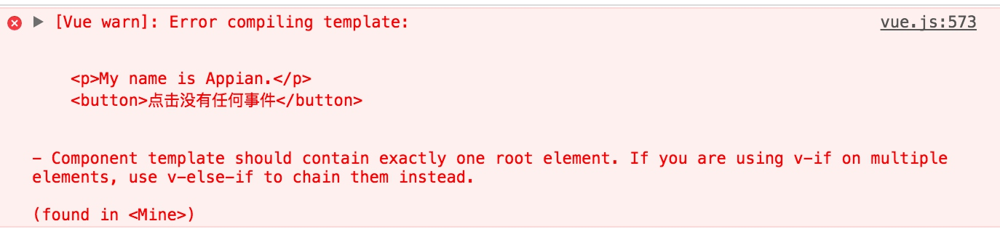
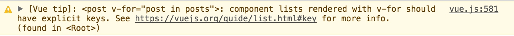

# 第三节： JS中组件的基本用法
在这一节里，我们将会了解到Vue2.0的组件，理解组件是如何工作的，并利用一系列的例子证明，用组件化的思想开发项目，会给你带来不一样感受。如果我们理解了Vue的组件化思想，我们就可以利用这个思想构造一个简化的评论社区系统，一个用户可以发布评论，其他用户可以在任意的评论上面投“赞成票”或者投“反对票”。

所以下面介绍的组件化项目就是类似于【知乎投票】的项目。

## 理解组件，注册第一个组件
利用组件能够很好的把一个你正在构建的具有复杂接口的应用拆分开来，同时，组件也具有很高的复用性，即使是在你正在开发的是不同的项目也能封装复用。

先创建一个简单的html页面，并将Vue实例化后挂载在我们的DOM元素上（使用el，这里不再多说）。

现在我们已经把在Vue的基础实例准备好了，然后我们将创建第一个简单的，可复用的组件。
在Vue中，注册组件的方法有很多种，第一，你可以使用`**Vue.component()**`来创建和注册你的组件，这个构造器有两个参数：
> 1. 组件的名字
> 
> 2. 包含组件参数的对象

这个对象有点像Vue()构造器里的对象，它也有类似于Vue()里的el属性和data属性，但是又有点不一样。

Vue()构造器的el和data可以是对象。
**Vue.component()构造器的el和data只能是函数，return一个对象。**

现在来看看第一个组件是如何运作的。首先注册一个组件，用p标签输出一行自我介绍。具体做法是先填入以下两个参数：
> * 组件的名字:'mine' 【最好遵守w3c的规范：小写，并且包含一个短杠】
> * 包含组件参数的对象：这个对象包含一个属性'template'

```js
Vue.component('mine',{
    template : '<p>My name is Appian.</p>'
})
```

组件有了，就可以在挂载区域内的任何地方使用它。只要把唯一标识(就是组件名字)作为一个dom注入到body上，比如<mine></mine>，组件上注册的内容就会在自定义标签的地方插入。

```html
 <div id="vueInstance">
   <!-- 标识注册的内容会在这里插入,并且可以重复插入 -->
    <mine></mine>  
    <mine></mine>
    <mine></mine>  
 </div>

 <script>
       Vue.component('mine',{   //这里就是注册的内容
           template : '<p>My name is Appian.</p>'
       });
       var V = new Vue({
             el : '#vueInstance'
       });
 </script>
```

Vue使用模板Template来代替组件，并使自定义的唯一标识用html标签插入到DOM结构中去，使得html更加简洁、整齐和直观。

## 利用template标签处理复杂组件
现在你可能会想，组件怎么可能只有一行p标签？一行p标签还有必要组件这么麻烦吗？是的，组件是为了更复杂的封装复用而生的。所以，如果你只会Vue.component()构造器中的template属性定义html代码，利用字符串拼接拼出所有的代码，这样只会让你比用jq更加疲惫不堪。

为了避免上面的这种情况，所以我们可以用template标签（注意属性和标签是不一样的）来达到我们的目的。可以在页面的任何地方，定义template标签，并在template标签内，写好我们的模板。因为template标签在页面加载的时候不会渲染出来，只有在我们需要它的时候，这个标签内的内容才会被渲染出来。所以，你可以把template标签放在任何地方，并给它一个id，以便在组件注册的时候能够找到模板（就是把模板的id赋值给template）。

```html
 <div id="vueInstance">
    <mine></mine>   //标识注册的内容会在这里插入
 </div>

 <template id="mineTpl">
        <!--如果不用div包裹。这里会报错，因为没有把组件内容包裹起来，错误见下方截图-->
        <div>
             <p>My name is Appian.</p>
             <button>点击没有任何事件</button>
        </div>
 </template>

 <script>
       Vue.component('mine',{   
           template : '#mineTpl'  //在这里绑定该注册的组件要渲染的模板
       });
       var V = new Vue({
             el : '#vueInstance'
       });
 </script>
```

如果一个组件没有一个根元素把它包裹好的话，


我们现在已经可以利用这样的方法创建一个复杂的组件了。这样我们可能将复杂的代码进行功能分区之后组件化，用组件的思想避免代码一坨一坨的。组件化能够帮你更清晰的组织好你的模块，使你的组件更加vue化。

## 通过props向组件中传递数据
每次创建组件实例的时候，这个实例都划分了自己的组件范围，这个范围导致了在这个组件区域内无法获得其父组件的数据。所以，Vue是如何处理父组件向子组件中传递数据的呢？答案是，通过props。

先看一个最简单，从父组件向子组件中传递data的例子。注册的mine组件是子组件，他希望从父组件那里得到‘city’这个数据的信息，所以在mine的构造器里增加了一个参数props，用来接收父组件传递过来的city的值。

```js
Vue.component('mine',{
    template : '<p>Appian is from {{ city }}.</p>',
    props : ['city']
});
```

上面的例子中，我们定义了props作为一个数组，所以props可以用来接收多个字段，而这些字段就是子组件期望从父组件那里得到的。

props不一定要是数组，也可以是对象。可以在对象中详细的定义很多props的限制条件。但平时用的很少，用默认值一般都是ok的，除非有特殊情况。

```
Vue.component('mine',{
    template : '<p>Appian is from {{ city }}.</p>',
    props : {
        city : {
            type : String,//定义字符串类型
            required : true,//该字段是必须的
            default : 'China'//设置默认值
        }
    }
});
```
> 也就是说，我们不需要每次都将props的限制条件都写出来，因为在这个例子中的数据是一个很简单的字段，上例中只是为了完整展示props的对象表示方法，所以才展开来写的。

那父组件那里又是怎么指派字段给子组件的呢？

```html
    <mine :city="FuJian-YongAn"></mine>
```

这样直接在mine标签里面定义**‘city’**父子组件props传值字段，就是父组件指派字段的方式之一。但是这样直接指派是很瞎的，我们需要的是动态变化的city，这个一会我们会说到的。

先简单介绍一下我们接下来要做的事。我们要假装我们正在搭一个博客，博客需要展示作者的基本信息，此时，我们可能会需要一些数据对象，可能是从数据库获得的，或者ajax请求到的，总之就是请求到了之后，将这个数据对象已经定义好在父级的data中了。并在html的template标签中准备渲染。

```html
<div id="vueInstance">
    <mine></mine> //标识注册的内容会在这里插入，之后也要展开来说！！！
</div>

<template id="mineTpl">
     <h1>{{ name }}</h1>
     <h2>{{ title }}</h2>
     <h3>{{ city }}</h3>
     <p>{{ content }}</p>
</template>

<script>
    //Vue.component()的构造在下文中展开来说！！！

    var V = new Vue({
         el : '#vueInstance',
         data : {
            name : 'Appian',
            title : 'This is a title',
            city : 'FuJian-XiaMen',
            content : 'There are some desc about Appians Blog'
         }
    });
</script>
```

准备好模板渲染之后，当然也要注册mine的构造器Vue.component()。除了基本的绑定模板id（#mineTpl）之外，还需要指定这个子组件想要的数据的字段名，并把期望得到的4个字段写在props中。

```js
Vue.component('mine',{
   template : '#mineTpl',
   props : ['name','title','city','content']// 以数组的形式配置好期望渲染到子组件的字段
});
```

这样我们就能告诉父级，子组件需要的字段是哪些。接下来父级就可以指派字段的值给子组件了。前面的city字段是写死的，现在这里绑定的字段就是动态绑定的。

```html
<mine :name='name' 
      :title='title'
      :city='city'
      :content='content'
  ></mine>
```

> **等号左右两边的字段名称可以不一样。**
> **等号左边的字段名，是指在子组件的props中声明的名字。在html写成肉串式，但是在props中可以写成驼峰式。**（因为html的解析是忽略大小写的）
> **等号右边的字段名，是指在父级里data定义的字段名。**
>
> **‘:’是‘v-bind’的缩写**

这样就能把父组件的4个字段绑定到子组件上。现在，只要父组件指派的字段的值一发生改变，子组件的值也会发生相应的改变。

## 构建一个简易评论社区系统
现在就可以利用前面学到的内容，搭建一个简易的评论社区系统，样式什么的先不管，只讲究js的具体实现。

* 创建一个新的Vue实例
* 给实例挂载一个div（#vueInstance）
* 定义数据，然后渲染。

```html
<div id="vueInstance">
    <div class="container">
        <ul>
           //这里即将渲染出评论的投票列表
        </ul>
    </div>
</div>

<template id="postTpl">
    <li>
      <span>票数：{{ votes }} ---</span>
      <a>话题：{{ post.title }}</a><br/>
      <i class="up" @click="upvote" :class="{disabled: upvoted}">我支持</i>
      <i class="down" @click="downvote" :class="{disabled: downvoted}">我反对</i>
      <br/><br/><br/>
    </li>
</template>

<script>
    //Vue.component()的构造在下文中展开来说！！！

    var V = new Vue({
         el : '#vueInstance',
         data : {
             posts: [{
                title: '请大大多多为我投票，我给大家发红包',
                votes: 15
             },{
                title: '投我准没错',
                votes: 53
             },{
                title: '不要投给我楼上的',
                votes: 10
             }]
         }
    });
</script>
```

这里会出现一个警告：

多个组件重复渲染的时候，会需要一个key来作为每个循环元素的唯一标识。根据警告，可以点开链接查看报错，然后在循环的子组件上绑定key作为唯一标识。

```html
<ul>
    <post v-for="post,index in posts" :post="post" :key="'li-' + index"></post>
</ul>
```

现在我们已经事先构造好了列表数据，有投票的话题和投票人数。然后再构造好模板（template标签），这个模板值用来渲染单个话题。模板里有除了渲染话题和投票人数，还有两个按钮，用来投赞成票或者反对票。之后我们只需要在html循环模板，然后就能多次插入模板，渲染成列表。当然也可以在模板里渲染好列表再一次插入。我们先用前一种方法。

不管css的样式问题，现在就可以开始注册Vue.component()构造器了，以便我们渲染页面。在注册的时候要明确，注册的子组件需要的props是父级的posts数组中的一个元素对象post。所以我们应该这样注册：

```js
Vue.component('post',{
    template : '#postTpl',
    props : ['post']
});
```

然后我们使用自定义的<post>标签插入在html中去。

```html
<div id="vueInstance">
    <div class="container">
        <ul>
           <post v-for="post,index in posts" :post="post" :key="'li-' + index"></post>
        </ul>
    </div>
</div>
```

这样我们就已经完成了循环输出posts数组了。因为我们把数组的元素指派给了子组件，所以子组件就可以渲染title和vote。接下来要做的就是增加“赞成”和“反对”按钮的逻辑代码，并我们需要对投票状态进行锁定，就是如果我们投了某个话题的赞成票就不能再投该话题的反对票，反之亦然。
所以让我们开始在模板里面定义点击事件吧，投赞成票的事件叫做“upvote”，投反对票的事件叫做“downvote”。
```js
Vue.component('post',{
    template : '#postTpl',
    props : ['post'],
    data : function (){
        return {  //data必须为function，定义投票状态
            upvoted: false,
            downvoted: false
        }
    },
    methods : {
        upvote : function() { //点击赞成的事件
            this.upvoted = !this.upvoted;
            this.downvoted = false;
        },
        downvote: function() { //点击反对的事件
            this.downvoted = !this.downvoted;
            this.upvoted = false;
        }
    }
});
```

> 注意，data里面的两个布尔值的定义是作为一个函数的返回的对象定义的。那是因为我们想要给每一个组件都设置一个是否投票的状态。
>**（还记得之前说过，这次的列表渲染是循环渲染多个模板，每个模板都只是一个话题的相关信息，而现在在组件中定义的data：upvoted和downvoted，也是专属于某个模板的。）**
> 这样我们如果投了某个话题的赞成票，并不会影响剩下话题的投票情况。

接下来已经完成了点击事件的状态控制，那么点击“赞成”和“反对”会导致话题的票数发生变化。这个时候我们可以利用之前的教程中学过的computed属性进行计算。

> 组件也有computed属性哦~

```js
Vue.component('post',{
    template : '#postTpl',
    props : ['post'],
    data : function (){ //同上，略 },
    methods : {  //同上，略 },
    computed: {  //重点部分
        votes: function () {
            if (this.upvoted) {
                return this.post.votes + 1;
            } else if (this.downvoted) {
                return this.post.votes - 1;
            } else {
                return this.post.votes;
            }
        }
    }
});
```

现在我们的投票系统已经基本完成了。我们可能会希望我们的投票系统好看一点，直观一点。所以我们可以在按钮上绑定一些样式。比如当用户已经投了某个话题的赞成票或者反对票，就让这个按钮的color变成橙色。

```css
.disabled {
    color : orange;
}
```

到此为止，投票完成。

Vue是利用v-bind:class来进行样式绑定的，可以简写成一个‘:’。其绑定的内容是一个对象，对象里面是class的名字和class对应的状态。

```html
<template id="postTpl">
   <li>
      <span>票数：{{ votes }} ---</span>
      <a>话题：{{ post.title }}</a><br/>
      <i class="up" @click="upvote" :class="{disabled: upvoted}">我支持</i>
      <i class="down" @click="downvote" :class="{disabled: downvoted}">我反对</i>
      <br/><br/><br/>
    </li>
</template>
```

如果我们点击了某个话题的赞成按钮，则它的upvoted就会变成true，则disabled的样式就绑定到赞成按钮上去。如果点了该话题的反对按钮，则它的upvoted就会变成false，则disabled就不会绑定到赞成按钮上。以上就是模板最终的样子。

## 组件的复用性的利用
我们已经利用了我们对Vue的基本语法还有一些组件的基本操作，建立起了一个基本的话题投票系统。接下来，思考如何将这个投票系统组件进行复用。

复用的第一步关键点在于组件的命名。至少在构建你的组件的时候，要问自己，“是否其他地方也能用到这个组件？”

比如，在上面的例子中，posts的意思是，这个数据是从ajax的post请求过来的数据，为了便于理解，才取名为posts，为了让自己的组件名字一看就知道关联，所以把模板的id定义为#postTpl，tpl是template的简写，自定义标签的命名也是post。总之，就是这样的细节，不仅方便自己阅读，也方便其他人阅读你的代码。

现在评论系统需要增加一个功能，就是增加一个发布评论的功能。就是增加了一个发布评论的区域（#commentBox）。

```html
<div id="vueInstance">
    <div class="container">
        <ul>
            <post v-for="post,index in posts" :post="post" :key="'li-' + index"></post>
        </ul>


        <div id="commentBox">
            请输入评论内容并提交：
            <input type="text" v-model="comment" @keyup.enter="postComment">
            <button @click="postComment">提交评论</button>
        </div>
    </div>
</div>

<!--模板渲染不变  -->

<script>
//Vue.component()的注册不变。

var V = new Vue({
     el : '#vueInstance',
     data : {
          posts: [ ....... ],
          comment: ''
     },
     methods: {
         postComment: function() {
             this.posts.push({
               title: this.comment,
               votes: 0
             })
             this.comment = '';
         }
     }
});
</script>
```

输入框用v-model绑定了comment字段，为了无论用户输入什么，在提交的时候都能获得他输入的值。当用户按回车或者点击提交按钮的时候都会触发postComment方法。这里的事件绑定一个是用的回车事件 @keyup.enter，还有一个点击事件@click。postComment方法就是把话题和投票为0的对象push进posts数组中去，Vue会将新的模板自动渲染出来。

这样一个可复用的组件就构造完成了，组件化会节省开发者的很多时间。组件是否复用，也要结合开发的实际需求而定。

## 利用Vue文件定义组件的方式
在有了组件化编程的思想之后，可以阐释一下，实际我们的编程过程中，只有一个html入口文件，然后所有组件都是` .vue `文件。所有组件都受路由控制，按需加载。什么是路由，之后会详细解说。
`.vue` 文件不能直接在页面上渲染，需要编译，编译之后会被渲染成html，插入到页面上。

## 后记
到此为止，你就已经能够掌握了Vue的组件的基本使用，并且在上文中也利用了一个评论发布投票系统的例子来说明了组件的用法，并且简单介绍了如何复用。

> * 定义组件的三种方式，手写template、使用template标签 和 使用.vue文件
> * 利用 props，子组件可以定义期望父级传递下来的字段
> * 利用 'v-bind:' 或 ':' 在自定义标签的地方绑定父级指派的字段
> * 组件的 data 和 el 必须定义为function
> * 组件的复用
