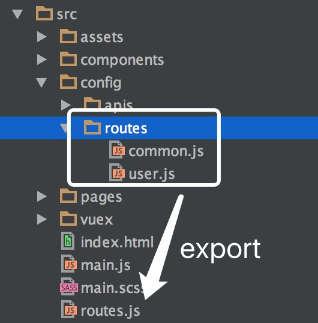

# 第四节： vue-router的基本用法
大型项目中总是存在着路由控制的问题。前端做路由，根据不同的路由加载对应的组件，对减少首屏时间，增加项目可控性有很大的帮助。

## 理解基本概念
首先分清楚两个概念`router` 和 `route`。
我们可以看一段react的代码
```html
<Router history={browserHistory}> 
    <Route path="/" component={Tab}>
        <IndexRoute component={pageA}/>
        <Route path="/pageb" component={pageB}/>
        <Route path="/pagec" component={pageC}>
            <Route path="/pagec/:username/:nickname" component={pageD}/>
        </Route>
    </Route>
</Router>
```
注意到最外层包裹的dom标签是**router**，而且在所有标签中**有且仅有一个router**标签。
注意到里面有很多**route**，甚至出现了**route嵌套route**，也出现了**indexroute**，**每个route都对应了一个path**。

> 由上可知，一个项目，有且只有**router**，并且router的控制权限最大，用来控制所有路由的基本配置。
> **route**对应指的是每个路径path需要对应的组件部分component。**route**也是允许嵌套的
> 用一句英文来表述就是**router routes routes.**

当然这里只是简单的举个例子，帮助分清这两个概念。大型项目中都是直接把routes用一个文件封装好成一个对象，然后循环对象，渲染上生面的dom。

## vue中routes
> routes 文件中的路由集中方式，是按照数组顺序来定义的优先级
> 
> 也就是说，routes中数组下标越小的数组元素越优先被匹配到

### 一般情况下的routes
担任协作的小型项目中，一般会在src目录下，有一个`routes.js`，专门用来把所有组件对应的模块配置都写在里里面。
```js
// src/routes.js
import Home from './components/Home.vue'
import Article from './components/Article.vue'
// 举例home模块和article模块，编写路由集合
const routes = [{
    name: 'Home', // 路由名，这个字段是可选的
    path: '/', // 路由路径，这里是根路径所以是'/'
    component: Home // 当path满足时渲染的组件模板
  },  {
    name: 'Article',
    path: '/article',
    component: Article
  }];
// 导出路由集合，为了在router.js中使用
export default routes;
```
###  我们的后台协作routes
先看一眼目录结构，`src/config/routes`文件夹下有两个js。`common.js`用来控制一些基本的路由。`user.js`用来控制一级导航下的所有route。每个一级导航对应一个routes文件夹下的js，这样便于分工协作，也可以对路由文件解耦。最后再把routes文件夹下的所有route都export到`src/routes.js`中，就能构造出一个加长版的简易路由文件。

 
## 把配置好的route作为参数传给总router
### 一般情况下的router
```js
import Vue from 'vue';
import VueRouter from 'vue-router'; // 引入路由的包
import routes from './routes'; // 引入上一节中配置好的routes

Vue.use(VueRouter);// 告诉vue要使用router

const router = new VueRouter({ // 实例化router对象
  mode: 'hash', // 设置路由模式 可选值: "hash" | "history" | "abstract"，默认"hash"
  linkActiveClass: 'link-active', // 这是链接激活时的class
  routes // 挂载路由集合 相当于routes: routes
})
```

### 我们的后台router
```js
import Vue from 'vue';
import VueRouter from 'vue-router';
import ROUTER from './routes'; // 引入上一节中集成好的routes

Vue.use(VueRouter);

const scrollBehavior = (to, from, savedPosition) => { .... };// 处理前进后退按钮的浏览器位置

const router = new VueRouter({
	routes: ROUTER.map,
	mode: 'history', // 只有在history的模式下可以使用scrollBehavior
	linkActiveClass: 'linkActive',
	scrollBehavior, // 专门用来实现页面回退或前进时能够回到上次浏览器的位置
});
```

### 路由的常见参数
```js
{
    name: 'bar', // 路由的名字，和path同时出现的时候，那么vue会选择使用name字段
	path: '/bar', // 定义一个相对路径，如果没有 / 则代表是绝对路径
	component: Bar, // 直接挂载一个组件
	children: [{ // 组件嵌套
		path: 'foo', //相当于'/bar/foo'
		component: (resoleve) { // 异步加载组件
    		require(['./../../component/foo.vue'], resoleve);
    	}
	}],
    redirect: { name: 'foo' }, // 重定向到另一个组件，url会从‘/bar’被替换成为name为foo的组件的url
    alias: '/foo' // /bar 的别名是 /foo，意味着，当用户访问 /foo 时，虽然URL 会保持为 /foo，但是路由匹配则为 /bar匹配到的组件，就像用户访问 /bar 效果一样。
    // 利用别名可以自由地将 UI 结构映射到任意的 URL，而不是受限于配置的嵌套路由结构。
	meta: { 
	   scrollToTop: true, // 需要记录滚动条位置
       keepAlive: true //缓存
	}, 
}
```

**也可以一个路由可以有多个组件构成，组件的key和router-view的name相对应**

```html
  <router-view class="view one"></router-view> //name默认为default
  <router-view class="view two" name="a"></router-view>
  <router-view class="view three" name="b"></router-view>
```
```js
 {
	    path: 'zee',
	    components: { // 复数形式
            default: Foo,
            a: Bar,
            b: Baz
      }
}
```


## 在入口文件中引入router文件，并渲染
### 一般情况下的入口js
```js
import Vue from 'vue';
import router from './router'; // 把router引入
import App from './App'; // 事先写好的主页的最外层包裹着的组件

new Vue({
  router, // 这是ES6对象的简写，扩展开就是router: router
  render: h => h(App) // 这里扩展开就是render: (h) => { return h(App) }
}).$mount('app');
```

### 我们后台的入口js
```js
import './assets/scss/_reset.scss';
import './main.scss';
import Vue from 'vue';
import Vuex from 'vuex';
import store from './vuex/store';

Vue.use(Vuex);

const router = new VueRouter({ ... });

new Vue({
	data: {
		navlist: ROUTER.list,
		status: -1,
		optionArr: [],
		urlnavArr: [],
		hasToken: true,
	},
	mounted() {
	},
	methods: {
		homepage() {
			router.go({ name: 'homepage' });
		},
		clicktag(num) {
			if (num === this.status) this.status = -1;
			else this.status = num;
		},
	},
	router,
	store,
}).$mount('#container');
```

## 在页面中指定的dom中渲染
### `<router-view>`用于指定组件渲染的位置
```html
<!-- 配置转场动画-->
<transition name="fade" mode="out-in">
  <!-- 缓存组件，需要在transition的内层-->
  <keep-alive>
    <!-- 一个 functional 组件，渲染路径匹配到的视图组件， 允许嵌套 -->
    <router-view></router-view> 
  </keep-alive>
</transition>
```
### `<router-link>`渲染成a标签或任意标签
`<router-link>` 可以添加各种属性，简单解释常用属性：

#### `to` 路由跳转属性
```html
<router-link to="/article">Article</router-link>
<!-- 渲染结果 -->
<a href="/article">Article</a>

<!-- 另一方面to也可以使用对象，即前面route中配置的对象 -->
<!-- 命名的路由，下面的结果为/homepage/user/123 -->
<router-link :to="{ name: 'user', params: { userId: 123 }}">User</router-link>

<!-- 带查询参数，下面的结果为 /homepage?plan=private -->
<router-link :to="{ path: 'register', query: { plan: 'private' }}">Register</router-link>
```

> name 和 path 二者选其中之一，如果两种都使用，那么vue会选择使用name字段

#### `replace` 路由跳转属性
```html
<router-link :to="{ path: '/abc'}" replace></router-link>
```
如果使用了replace属性，则这个路由不会留下历史记录

#### `append` 将当前路径设置为相对路径
如果当前页面路径为`www.baidu.com/demo1`
```html
<router-link :to="{ path: 'article'}" append></router-link>
```
页面最终路径为`www.baidu.com/demo1/article`

#### `tag` 指定link渲染成指定的标签
```html
<router-link to="/article" tag="li">article</router-link>
```
最终会被渲染成`<li>article</li> `

#### `active-class` 指定激活的样式
```html
<router-link to="/article" active-class="link-active">article</router-link>
```
最终会被渲染成`<a href="/article" class="link-active"></a> `

也可以采用之前js的办法
```js
const router = new VueRouter({
  mode: 'hash',
  linkActiveClass: 'link-active', // 这是链接激活时的class
  routes
})
```
#### `exact` 严格模式
如果当前页面路径为`www.baidu.com`
```html
<router-link to="/" exact>home</router-link>
```
不加exact属性，则会在如果当前页面路径为`www.baidu.com/article`页面下也会被匹配到，
这却不是我们的本意,在加了这个属性后就会正确的匹配到`www.baidu.com`下

