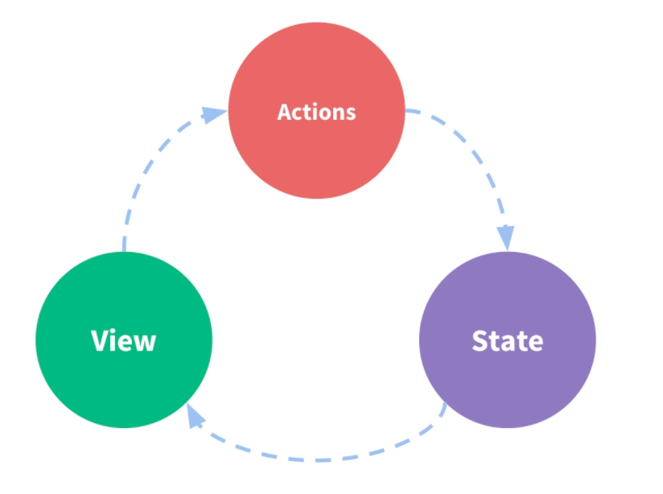
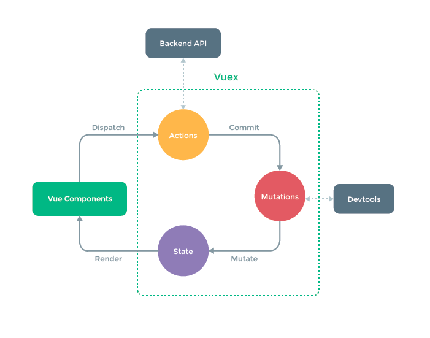
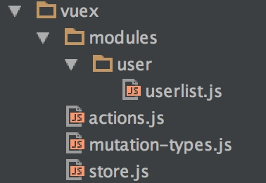

# 第五节：vuex状态管理工具
数据流的双向绑定带来便利的同时也提升了不少的耦合度，当业务复杂度增加到一定程度上的时候，数据变得越来越难以控制。

## 什么是状态管理工具
vuex是vue的大型项目的状态管理工具。那什么是状态管理工具呢？

一个应用一般有三部分组成：`state`、`view`、`actions`



> `state`是驱动一个项目运作的动力，有了state，项目才有意义。
> `view`是state的一种映射。state的状态会通过view反映出来。
> `actions`用户在view上引起的需要更新state的操作。

比如，小明（view === ‘小明在上班’）目前的状态是上班中（state === ‘上班’），小明现在生病了，想要调休，他需要提交一个请假条给老板（action === ‘提交请假条’），如果请假条批准了（action完成了），小明就可以即刻开始调休（state === ‘调休中’），这是小明也会变成在调休（view === ‘小明在调休’）

但是实际的业务场景比这个复杂的多，可能会出现多个组件（相当于多个view）需要共享一个数据（相当于共享一个state）。也可能会出现多个组件（相当于多个view）会去操作和修改同一个数据（相当于同时操作一个state）。

第一个问题就是，父子组件能够通过props很好的共享同一个数据，但是兄弟组件共享数据会变得很复杂。第二个问题就是，如果父子组件通过事件分发解决了数据的更新问题，那可能其他和该数据相关的组件也会相应的更新，导致了一个数据的修改会更新很多个view，导致数据变得难以控制。

所以为了提高代码的可维护性，把这些频繁公用的数据独立出来，使用一个专门的管理工具进行管理。vuex就是一种。


上面的View层现在被Vue Components给替代了。
并且在数据流中增加了一个mutation。而vuex管理的部分就是`Actions`、`State`、`Mutations`。

比如，小明的一个同事是一个component，小明的很多同事也要请假（vue components === ‘小明的很多同事在上班’）目前的状态是上班中（state === ‘集体上班’），他们集体需要提交一个请假条给老板（action === ‘多人提交一张请假条’）， 请假条批准了（action完成了），每个同事都有一个自己的一个同步操作去修改自己的state， 这个修改的操作就是mutations，mutation负责把每个人的状态的state从‘上班中’ 调整为 ‘调休中’，所有同事就可以开始休假了（vue components === ‘小明的很多同事在休假’）。

## vuex的目录结构

```
+--- vuex
     +--- modules 所有模块会用到的vuex数据都放在一起
          +--- user 以业务模块划分
               +--- userlist 用户列表业务会用到的所有状态
     +--- actions 公共action的集合
     +--- mutation-types 所有状态的字符串的变量存储
     +--- store 所有页面的仓库状态集合
```

## vuex中每个业务中会涉及到的属性
```js
import {
	GET_USER_USERLIST,
} from './../../mutation-types'; // 从所有状态列表中获得需要的关键字

import { initUserlist } from '../../../config/apis/user.api'; // 模拟一个用户列表初始化的异步请求


const state = { // 可能会出现公用的状态
	list: [],
	totalPages: -1, // 总页数
	number: -1, // 当前页数
};

const getters = { // 定义在组件中使用的字段
	list: state => state.list,
	totalPages: state => state.totalPages,
	number: state => state.number,
};

const actions = { // 处理一些异步请求，等异步请求返回结果后把同步操作指派给mutations
	initlist({ commit, state }) {
		initUserlist().then(ret => {
			if (ret.errCode === 200) {
				commit(GET_USER_USERLIST, ret);
			} else alert(ret.errMsg);
		});
	}
};

const mutations = { // 处理同步操作，更新state
	[GET_USER_USERLIST](state, ret) {
		Object.assign(state, ret);
	}
};

export default { //导出，为了能够汇总在store.js中
	state,
	getters,
	actions,
	mutations,
};
```

## 在vuex中的action的参数实际上是一个对象store，用花括号解构
```js
{
  state,     // 等同于 store.state, 若在模块中则为局部状态
  rootState, // 等同于 store.state, 只存在于模块中
  commit,    // 等同于 store.commit
  dispatch,  // 等同于 store.dispatch
  getters
}
```

```js
store.commit('increment')
store.dispatch('incrementAsync', {
  amount: 10
})
```

## 在组件中使用vuex
```js
computed: {
    ...mapGetters({ // 需要使用到的vuex里的state    
        list: 'list',
        totalPages: 'totalPages',
        number: 'number',
    }),
    testCount() { // 其他组件内data
        return `${this.totalPages + this.number}###`;
    },
},
methods: {
    ...mapActions([
        'initlist', // 匹配到的方法调用是this.initlist();
    ]),
    reset(num) { // 其他组件内方法
        console.log(num);
    },
},
```
这样就把组件和vuex连接起来了。

> 实际是vuex给每一个属性都提供了map方法
> 
> `import { mapState, mapGetters, mapActions, mapMutations } from 'vuex'`
 
```js
import { mapState, mapGetters, mapMutations, mapActions } from 'vuex'
export default {
  data () {
    return {
    }
  },
  computed: {
  // vue的计算属性，计算属性内方法的私有变量变动会触发这个属性的重新计算
    ...mapState({
      mapStateFollow: ({demo}) => demo.demoFollow,
      mapStateFollowPending: ({demo}) => demo.demoFollowPending
    }),
    // mapState()直接读取State里的状态内容
    ...mapGetters(['demoFollowStatus'])
    // mapGetters()通过getters转化state从而得到你想要的内容
  },
  methods: {
  // vue的方法，可以是一个事件的方法，也可以是一个vuex的方法，也可以是一个普通函数
    ...mapMutations(['DEMO_VUEX_FOLLOW']),
    // 同步的改变状态
    ...mapActions(['demoFollowAjax'])
    // 异步的改变状态
  }
}
```


